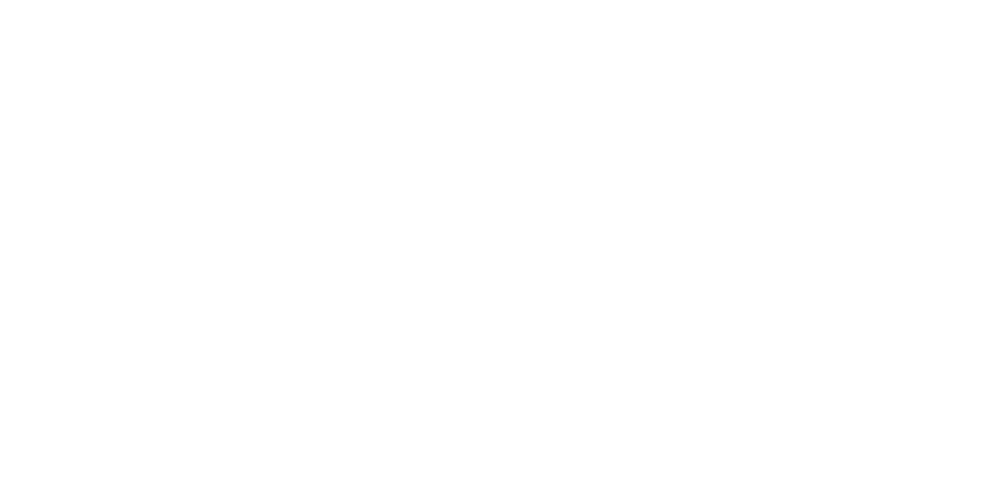
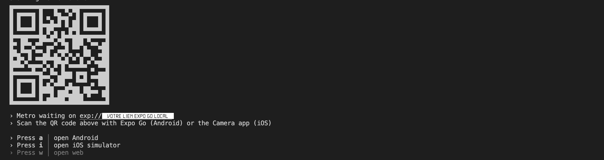
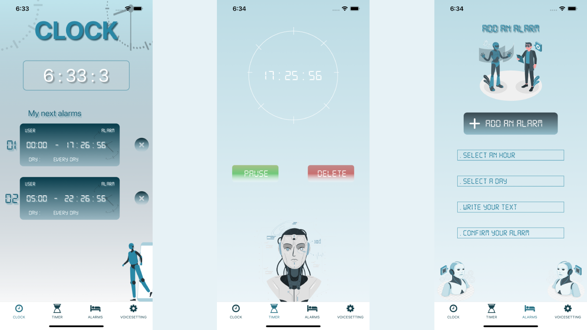
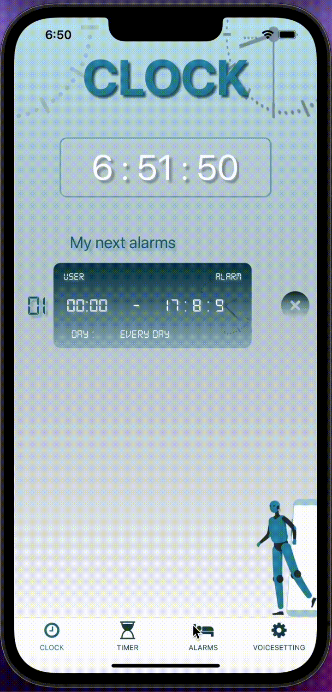

<div id="" align="center">
  
</div>

# TIME CLOCK

Time Clock est une application mobile innovante conçue pour simplifier la gestion de vos alarmes quotidiennes. Grâce à cette application, vous pouvez créer des alarmes personnalisées en ajoutant votre propre texte, qui sera ensuite prononcé par une voix. Cette fonctionnalité unique combine la praticité d'une alarme traditionnelle avec la personnalisation d'un message vocal, offrant ainsi une expérience réveil plus engageante et adaptée à vos préférences.

# Technologie utilisée

- javascript
- react-native
- expo
- react-redux

# Installation

Installez l'application Expo Go sur votre téléphone avec app store ou play store
<div id="" align="start">
  
    
    
</div>

Exécutez ces lignes de commande dans votre terminal sur votre ordinateur
`````bash
git clone https://github.com/ezeflt/Time_clock.git
cd Time_clock
yarn install
yarn start
`````

Vous devriez voir ceci
<div id="" align="start">
  
</div>


- Si vous êtes sur Iphone scannez ce QR code
- Si vous êtes sur Android copiez tout le lien exp://192. .... et collez l'url manuellement sur Expo Go
- Si vous êtes sur MacOS press i pour ouvrir un émulateur d'iphone
- Si vous êtes sur Window press a pour ouvrir un émulateur d'android
</br></br>

## Présentation de l'application

|page d'accueil|minuteur page|page d'ajout d'alarme
|-----------|--------------|-----------|
<div id="" align="start">
  
</div>

# Voici une vidéo d'ajout d'alarme
1| Rendez-vous sur la page d'ajout d'alarme. </br>
2| Choisissez une heure.</br>
3| Saisissez le texte de votre alarme.</br>
4| Attendez que votre alarme se déclenche</br>
5| L'IA prononcera le texte de votre alarme jusqu'à ce que vous décidiez de stopper l'alarme
<div id="" align="center">
  
</div>

# Développeur 

Ezechiel Felten </br>

feltenezechiel1@gmail.com</br>
[linkedin](https://www.linkedin.com/in/ezechiel-felten-475693248/)</br>
[portfolio](https://ezechiel-app.vercel.app/)</br>
